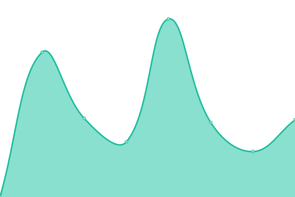
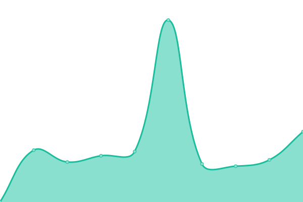
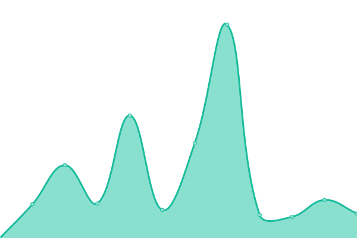

# [📈 Trạng thái hiện tại](https://status.builetuananh.name.vn): <!--live status--> **Hệ thống hoạt động bình thường**

This repository contains the open-source uptime monitor and status page for [Anthony Bùi Lê Tuấn Anh](https://www.builetuananh.name.vn), powered by [Upptime](https://github.com/upptime/upptime).

With [Upptime](https://upptime.js.org), you can get your own unlimited and free uptime monitor and status page, powered entirely by a GitHub repository. We use [Issues](https://github.com/anthony2708/status/issues) as incident reports, [Actions](https://github.com/anthony2708/status/actions) as uptime monitors, and [Pages](https://status.builetuananh.name.vn) for the status page.

## [📈 Live Status](https://demo.upptime.js.org): <!--live status--> **Hệ thống hoạt động bình thường**

<!--start: status pages-->
<!-- This summary is generated by Upptime (https://github.com/upptime/upptime) -->
<!-- Do not edit this manually, your changes will be overwritten -->
<!-- prettier-ignore -->
| URL | Status | History | Response Time | Uptime |
| --- | ------ | ------- | ------------- | ------ |
|  [Main Website](https://www.builetuananh.name.vn) | Hoạt động | [main-website.yml](https://github.com/anthony2708/status/commits/HEAD/history/main-website.yml) | 

 1085ms
     
 | 

<a href="https://status.builetuananh.name.vn/history/main-website">100.00%</a>
    

|  [90DevOps Website](https://90days.builetuananh.name.vn) | Hoạt động | [90-dev-ops-website.yml](https://github.com/anthony2708/status/commits/HEAD/history/90-dev-ops-website.yml) | 

 1021ms
     
 | 

<a href="https://status.builetuananh.name.vn/history/90-dev-ops-website">100.00%</a>
    

|  [Students@VNU-HCMUS](https://student.hcmus.edu.vn) | Hoạt động | [students-vnu-hcmus.yml](https://github.com/anthony2708/status/commits/HEAD/history/students-vnu-hcmus.yml) | 

 1330ms
     
 | 

<a href="https://status.builetuananh.name.vn/history/students-vnu-hcmus">96.06%</a>
    

|  [VNU-HCMUS Portal - 1st Node](https://portal1.hcmus.edu.vn) | Hoạt động | [vnu-hcmus-portal-1st-node.yml](https://github.com/anthony2708/status/commits/HEAD/history/vnu-hcmus-portal-1st-node.yml) | 

 2370ms
     
 | 

<a href="https://status.builetuananh.name.vn/history/vnu-hcmus-portal-1st-node">100.00%</a>
    

|  [VNU-HCMUS Portal - 2nd Node](https://portal2.hcmus.edu.vn) | Hoạt động | [vnu-hcmus-portal-2nd-node.yml](https://github.com/anthony2708/status/commits/HEAD/history/vnu-hcmus-portal-2nd-node.yml) | 

 2432ms
     
 | 

<a href="https://status.builetuananh.name.vn/history/vnu-hcmus-portal-2nd-node">99.80%</a>
    

|  [VNU-HCMUS Portal - 3rd Node](https://portal3.hcmus.edu.vn) | Hoạt động | [vnu-hcmus-portal-3rd-node.yml](https://github.com/anthony2708/status/commits/HEAD/history/vnu-hcmus-portal-3rd-node.yml) | 

 2133ms
     
 | 

<a href="https://status.builetuananh.name.vn/history/vnu-hcmus-portal-3rd-node">100.00%</a>
    

|  [VNU-HCMUS Portal - 4th Node](https://portal4.hcmus.edu.vn) | Hoạt động | [vnu-hcmus-portal-4th-node.yml](https://github.com/anthony2708/status/commits/HEAD/history/vnu-hcmus-portal-4th-node.yml) | 

 2241ms
     
 | 

<a href="https://status.builetuananh.name.vn/history/vnu-hcmus-portal-4th-node">99.81%</a>
    

|  [VNU-HCMUS Portal - 5th Node](https://portal5.hcmus.edu.vn) | Hoạt động | [vnu-hcmus-portal-5th-node.yml](https://github.com/anthony2708/status/commits/HEAD/history/vnu-hcmus-portal-5th-node.yml) | 

 2078ms
     
 | 

<a href="https://status.builetuananh.name.vn/history/vnu-hcmus-portal-5th-node">100.00%</a>
    

|  [VNU-HCMUS Portal - 6th Node](https://portal6.hcmus.edu.vn) | Hoạt động | [vnu-hcmus-portal-6th-node.yml](https://github.com/anthony2708/status/commits/HEAD/history/vnu-hcmus-portal-6th-node.yml) | 

 1834ms
     
 | 

<a href="https://status.builetuananh.name.vn/history/vnu-hcmus-portal-6th-node">100.00%</a>
    

<!--end: status pages-->

[**Visit our status website →**](https://status.builetuananh.name.vn)

## 📄 License

- Powered by: [Upptime](https://github.com/upptime/upptime)
- Code: [MIT](./LICENSE) © [Anthony Bùi Lê Tuấn Anh](https://www.builetuananh.name.vn)
- Data in the `./history` directory: [Open Database License](https://opendatacommons.org/licenses/odbl/1-0/)
